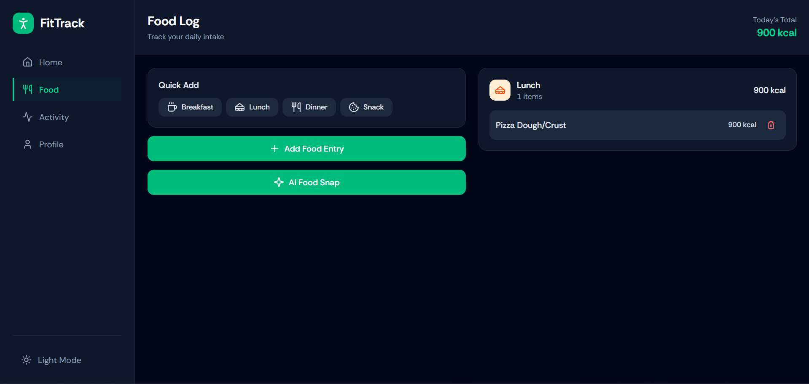
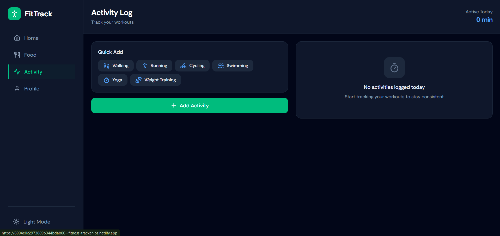
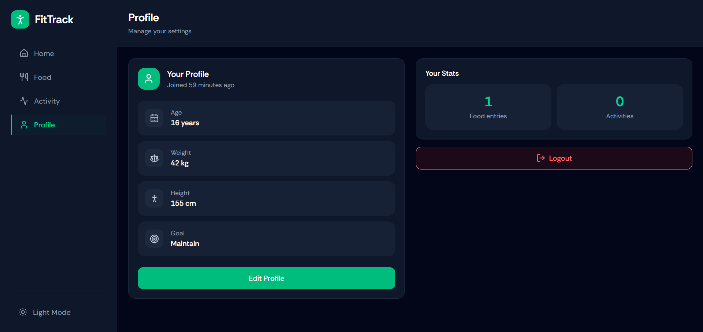

# 🏋️ FitTrack – Fitness Tracker (Full Stack)

FitTrack is a full-stack fitness tracking web app where users can log daily food intake and activities, track calories, manage their profile, and use an AI-powered feature to estimate food calories from an image.

- Frontend: Deployed on Netlify
- Backend (Strapi): Deployed on Render

---

## ⭐ Key Highlights

- Full-stack app with React + TypeScript frontend and Strapi backend
- JWT authentication + protected routes
- Food and activity logs are fully user-specific (secure controllers)
- AI food image analysis using Gemini API (auto calorie estimation)
- Deployed with Netlify (frontend) + Render (backend)

## 🚀 Live Demo

- Frontend (Netlify): [See Live Demo of Frontend](https://6994e0c2973889b344bdab00--fitness-tracker-bs.netlify.app)
- Backend (Render / Strapi API): [API of this project](https://fitness-tracker-0vm7.onrender.com)

---

## 📸 Screenshots

| Home                      | Food Log                      |
| ------------------------- | ----------------------------- |
|  |  |

| Activity Log                      | Profile                      |
| --------------------------------- | ---------------------------- |
|  |  |

---

## ✨ Features

### 🔐 Authentication

- Signup + Login using Strapi Auth
- JWT-based protected routes
- Persistent login on refresh

### 👤 User Profile

- Update age, weight, height, goal
- Member since indicator
- Tracks onboarding completion

### 🍽 Food Log

- Add food entries with calories + meal type
- View today’s food grouped by meal type
- Delete entries
- Daily calorie total

### 🏃 Activity Log

- Add activity entries with duration + calories
- Quick add activities
- View today’s activities grouped by type
- Delete activities
- Total active minutes today

### 🤖 AI Food Snap

- Upload a food image
- AI extracts food items + estimates calories
- Auto-fills food form with suggested values

---

## 🛠 Tech Stack

### Frontend

- React + TypeScript
- Tailwind CSS
- Axios
- React Router
- React Hot Toast
- Lucide Icons

### Backend

- Strapi (Headless CMS)
- JWT Auth (users-permissions)
- Custom Controllers (per-user data filtering)
- Render Deployment

### AI

- Gemini API (image-to-food calorie estimation)

---

## 📦 Environment Variables

### Frontend (.env)

VITE_BACKEND_URL=[https://your-backend-url.onrender.com](https://your-backend-url.onrender.com)

### Backend (.env)

HOST=0.0.0.0
PORT=1337
APP_KEYS=your_app_keys
API_TOKEN_SALT=your_token_salt
ADMIN_JWT_SECRET=your_admin_secret
JWT_SECRET=your_jwt_secret
GEMINI_API_KEY=your_gemini_api_key

A .env.example file is included in the repo.

---

## 🔗 API Routes (Backend)

### Auth (Strapi default)

- POST /api/auth/local
- POST /api/auth/local/register
- GET /api/users/me

### Food Logs

- GET /api/food-logs
- POST /api/food-logs
- GET /api/food-logs/:id
- DELETE /api/food-logs/:id

### Activity Logs

- GET /api/activity-logs
- POST /api/activity-logs
- GET /api/activity-logs/:id
- DELETE /api/activity-logs/:id

### AI Image Analysis

- POST /api/image-analysis

---

## 🧪 Local Setup

### 1) Clone repo

git clone [https://github.com/your-username/your-repo-name.git](https://github.com/your-username/your-repo-name.git)
cd your-repo-name

### 2) Frontend Setup

cd client
npm install
npm run dev

Frontend runs on:
[http://localhost:5173](http://localhost:5173)

### 3) Backend Setup (Strapi)

cd server
npm install
npm run develop

Backend runs on:
[http://localhost:1337](http://localhost:1337)

Strapi Admin:
[http://localhost:1337/admin](http://localhost:1337/admin)

---

## 🔒 Notes About Security

- Food logs and activity logs are user-specific
- Controllers ensure users can only access their own entries
- Protected routes require JWT token

---

## 👨‍💻 Author

Built by Baibhav Sinha
